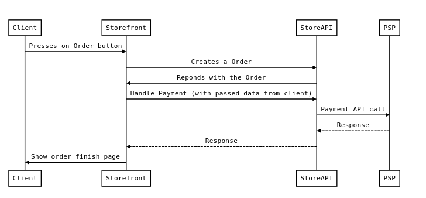
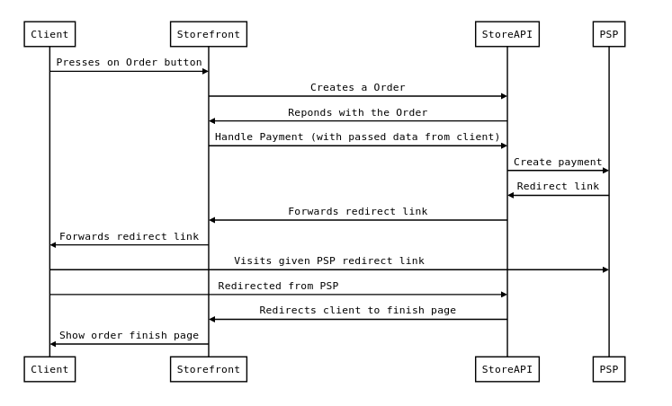
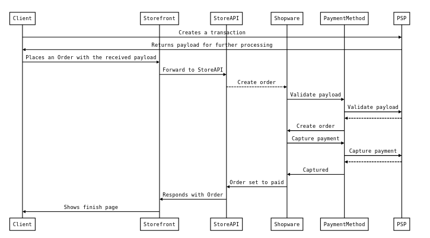

# 2021-10-01 - Payment Flow

## Context

We have to provide a standardized way to Shopware extensions to implement own payments.

## Decision

We implement two possible handlers **Synchronous Payment** and **Asynchronous Payment**. Both handlers can implement optional [Accepting-pre-created-payments](#accepting-pre-created-payments). If a [payment transaction fails](#after-order-payment-error-case), the user can choose a new payment method and trigger the flow again

## Handler

### Synchronous Payment

The synchronous payment is intended to execute a payment directly after the order has been created, **without a user interaction**. The client can pass additional data to the handler to process the payment of the order. The handler can throw an `SyncPaymentProcessException` if an error is occurred.

Here is a happy case sequence of a synchronous payment handling. The error handling is described [here](#after-order-payment-error-case) 

### Asynchronous Payment

The asynchronous payment is required to be used when the payment gateway website needs to be visited by the client. The client will be redirected to the actual payment site and the payment site will later be redirected to the success page / error page of the shop. The handler is executed on preparing the link and validating the redirect back from payment service.

Here is the happy case sequence of an asynchronous payment handling. The error handling is described [here](#after-order-payment-error-case) 

### App payments

The app payment flow is similar to the synchronous or asynchronous flow. The app can choose one and define an external http api endpoint. This http endpoint will be called instead executing regular PHP code. The response will define the further payment flow like in the examples above.

## Accepting pre-created payments

To improve the payment workflow on headless systems or reduce orders without payment, payment handlers can implement an additional interface to support pre-created payments. The client can prepare the payment directly with the payment service and pass the token to Shopware to complete the payment. 
The payment handler **has to verify the given payload with the payment service**. After verification the order will be created and the payment handler will be called again to **charge the payment**.
When the charge was successful the payment will be set to paid and the user will be forwarded to finish page, but on [failure the after order payment process will be active](#after-order-payment-error-case).
It is highly recommended implementing this optional feature, when the creation and the capturing of the payment can be seperated.

## After order payment (Error case)

Both possible options can produce a failure payment. In failure case the after order payment process begins. The client can choose a new payment method and retry the payment and the entire payment loop of a synchronous / asynchronous payment starts again.

