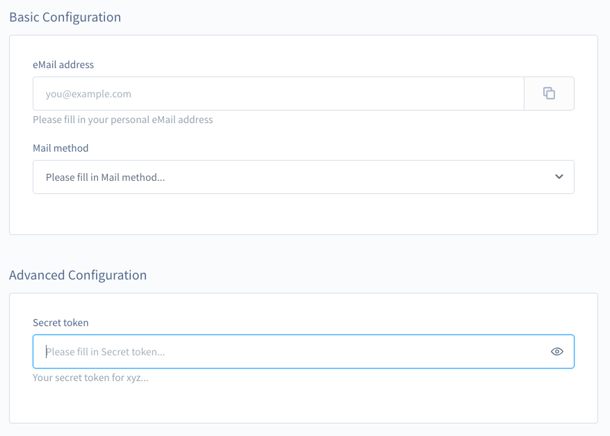

[titleEn]: <>(Plugin configuration)
[titleDe]: <>(Plugin configuration)
[wikiUrl]: <>(../plugin-system/plugin-configuration?category=shopware-platform-en/plugin-system)

The `Shopware plugin system` provides you with the option,
to create a configuration page for your plugin without any knowledge of templating or the `Shopware Administration`.
All you need to do is creating a `config.xml` file.
The content of the `config.xml` will be dynamically rendered in the administration.
Below you'll find an example structure.

```
└── plugins
    └── SwagExample
        ├── Resources
        │   └── config.xml
        ├── SwagExample.php
        └── composer.json
```

The `config.xml` follows a simple syntax. The content is organized in `<card>` elements.
Every `config.xml` must exist of minimum one `<card>` and each `<card>` must contain one `<title>` and at least one `<input-field>`.
Below you'll find the minimum `config.xml`.

```xml
<?xml version="1.0" encoding="UTF-8"?>
<config xmlns:xsi="http://www.w3.org/2001/XMLSchema-instance"
        xsi:noNamespaceSchemaLocation="https://raw.githubusercontent.com/shopware/platform/master/src/Core/System/SystemConfig/Schema/config.xsd">
    
    <card>
        <title>Minimal configuration</title>
        <input-field>
            <name>example</name>
        </input-field>
    </card>
</config>
```
*Resources/config.xml*

Please make sure to specify the `xsi:noNamespaceSchemaLocation` as shown above and fetch the external resource into `Phpstorm`.
This gives you auto-completion and suggestions.

## Card Titles
A `<card>` `<title>` is translatable, this is managed via the `lang` attribute.
Per default the `lang` argument is set to `en_GB`, to change the locale of a `<title>` just add the attribute as follows.

```xml
    ...
    <card>
        <title>English Title</title>
        <title lang="de_DE">German Titel</title>
    </card>
    ...
```

## Configuring input fields
As you could see above, every `<input-field>` must contain at least a `<name>`.
The `<name>` element is not translatable and must be unique.
It serves as your technical identifier. Your `<name>` must at least be 4 characters long and consist of only lower and upper case letters.

## The different types of input field
Your `<input-field>` can have different types, this is managed via the `type` attribute.
Per default, this attribute is set to `text`. 
Below you'll find a list of all `<input-field type="?">`.

| Type        | Options                                          | Renders                | 
|-------------|--------------------------------------------------|------------------------|
| text        | copyable, disabled, label, placeholder, helpText | Text field             |
| textarea    | disabled, label, placeholder, helpText           | Text area              |
| select      | options, disabled, label, placeholder, helpText  | Select box             |
| password    | disabled, label, placeholder, helpText           | Password field         |
| boolean     | disabled, label, helpText                        | Switch                 |
| switch      | disabled, label, helpText                        | Switch                 |
| checkbox    | disabled, label, helpText                        | Select box             |
| radio       | disabled, options, label, helpText               | Group of radio buttons |
| number      | disabled, label, helpText                        | Number field           |
| colorpicker | disabled, label                                  | Colorpicker            |
| datetime    | disabled, label, helpText                        | Date-time picker       |


## Options
Options are used to configure your `<input-field>`.
Every `<input-field>` must start with the `<name>` element.
After the `<name>` element you can configure any of the other options.

## disabled
You can add the `<disabled>` option to any of your `<input-field>` elements to disable it.
Below you'll find an example how to use this option.

```xml
<input-field>
    <name>email</name>
    <disabled>true</disabled>
</input-field>
```
*Please note, `<disabled>` only takes boolean values.*

## copyable
You can add the `<copyable>` option to your `<input-field>` with the default type `text`.
This will add a button at the right, which on click copies the content of your `<input-field>`.
Below you'll find an example how to use this option.

```xml
<input-field>
    <name>email</name>
    <copyable>true</copyable>
</input-field>
```
*Please note, that `<copyable>` only takes boolean values*

## options
You can use `<options>` to add options to a `<input-field>` of the types `select` and `radio`.
For the type `select` each `<option>` represents one option you can select.
For the type `radio` each `<option>` represents one radio button.
Below you"ll find an example.

```xml
<input-field type="select">
    <name>mailMethod</name>
    <options>
        <option>
            <value>smtp</value>
            <label>English label</label>
            <label lang="de_DE">German label</label>
        </option>
        <option>
            <value>pop3</value>
            <label>English label</label>
            <label lang="de_DE">German label</label>
        </option>
    </options>
</input-field>
```

Each `<options>` element must contain at least one `<option>` element.
Each `<option>` element must contain at least one `<value>` and `<label>`.
As you can see above, `<label>` elements are translatable via the `lang` attribute.

## Label, placeholder and help text
The options `<label>`, `<placeholder>` and `<helpText>` are used to label and explain your `<input-field>` and are translatable.
You define your `<label>`, `<placeholder>` and `<helpText>` the same way as the `<card><title>`, with the `lang` attribute.
Please remember, that the `lang` attribute is set to `en_GB` per default.
Below you"ll find an example. 
```xml
<input-field>
    <name>test</name>
    <label>English label</label>
    <label lang="de_DE">German Label</label>          
    <placeholder>English placeholder</placeholder>
    <placeholder lang="de_DE">German placeholder</placeholder>
    <helpText>English help text</helpText>
    <helpText lang="de_DE">German help text</helpText>
</input-field>
```

## Example
Now all that's left to do is to present you a working example `config.xml` and show you the result.

```xml
<?xml version="1.0" encoding="UTF-8"?>
<config xmlns:xsi="http://www.w3.org/2001/XMLSchema-instance"
        xsi:noNamespaceSchemaLocation="https://raw.githubusercontent.com/shopware/platform/master/src/Core/System/SystemConfig/Schema/config.xsd">

    <card>
        <title>Basic Configuration</title>
        <title lang="de_DE">Grundeinstellungen</title>
        <input-field>
            <name>email</name>
            <copyable>true</copyable>
            <label>eMail address</label>
            <label lang="de_DE">E-Mail Adresse</label>
            <placeholder>you@example.com</placeholder>
            <placeholder lang="de_DE">du@beispiel.de</placeholder>
            <helpText>Please fill in your personal eMail address</helpText>
            <helpText lang="de_DE">Bitte trage deine persönliche E-Mail Adresse ein</helpText>
        </input-field>
        <input-field type="select">
            <name>mailMethod</name>
            <options>
                <option>
                    <value>smtp</value>
                    <label>English smtp</label>
                    <label lang="de_DE">German smtp</label>
                </option>
                <option>
                    <value>pop3</value>
                    <label>English pop3</label>
                    <label lang="de_DE">German pop3</label>
                </option>
            </options>
            <label>Mail method</label>
            <label lang="de_DE">Versand Protokoll</label>
        </input-field>
    </card>
    <card>
        <title>Advanced Configuration</title>
        <title lang="de_DE">Erweiterte Einstellungen</title>
        <input-field type="password">
            <name>secret</name>
            <label>Secret token</label>
            <label lang="de_DE">Geheim Schlüssel</label>
            <helpText>Your secret token for xyz...</helpText>
            <helpText lang="de_DE">Dein geheimer Schlüssel für xyz...</helpText>
        </input-field>
    </card>
</config>
```


