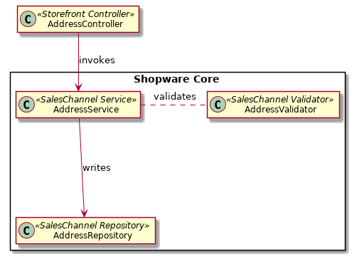

[titleEn]: <>(Writing data)
[hash]: <>(article:storefront_writing_data)

All routes mutating data are `POST` routes. Contrary to the data loading paradigm of the storefront 
(a deep nested structure) and the template organization (a deep nested structure) write operations 
are flat and forwarded directly from the controller to a core service. The whole picture (usually) looks like this:



Of course the core boundary is the important bit here. If modules in the core like - lets say - the 
[`Cart`](./../1-core/50-checkout-process/10-cart.md) provide a divergent structure internally this structure 
is used instead. However, there is always a core service used which is related to sales channel activities.

## CSRF protection

Every storefront `POST` request is checked for a valid CSRF token to prevent 
[Cross-Site-Request-Forgery](https://de.wikipedia.org/wiki/Cross-Site-Request-Forgery) attacks.
Shopware provides two different mechanisms for token generation: 
* The default recommended method is to generate CSRF tokens server side via twig and include them in forms.
* Ajax can also be used to generate token and append them to `POST` requests. The CSRF mode has to be set so 
`ajax` for this to work. This mode is needed if a third party cache provider like varnish should be used. 
More on this in the caching section below.

CSRF protection can be configured via [Symfony configuration files](https://symfony.com/doc/current/configuration.html).
`packages/storefront.yaml`: 
```yaml
storefront:
    csrf:
        enabled: true   // true/false to turn protection on/off
        mode: twig      // Valid modes are `twig` or `ajax`
```

### Append CSRF token to forms

Here is an example for a `twig`- and `ajax`- mode compatible form:
```twig
  <form 
    name="ExampleForm" 
    method="post" 
    action="{{ path("example.route") }}"
    data-form-csrf-handler="true">
      <!-- some form fields -->
    
      {{ sw_csrf('example.route') }}
    
  </form>
```
* The `sw_csrf` function is used to generate a valid CSRF token with twig and inject it as a hidden 
input field to the form. It also accepts a `mode` parameter which can be set to `token` or `input`(default):
    ```twig
    {{ sw_csrf('example.route', {"mode": "token"}) }}
    ```
    * Mode `token` renders only a blank token. This can be used to create a own input element or 
    to hand over the token to a JS plugin.
    * Mode `input` renders a hidden input field with the token as value
    * Important: Note that the parameter of the `sw_csrf` function must match the route name for the action. 
    Every token is only valid for a specific route.
* The data attribute `data-form-csrf-handler="true"` initialises the JS plugin if the `csrf` mdoe is set to `ajax`. 
This will fetch a valid token on submit and then appends it to the form.
    * The `FormCsrfHandler` plugin is only needed for native form submits.
    * `POST` requests made with the `http-client.service` are automatically protected when `csrf` mode is set to `ajax`

### Exclude controller action from CSRF checks

It is possible to exclude a controller `POST` action from CSRF checks in the route annotation:
```php
/**
 * @Route("/example/route", name="example.route", defaults={"csrf_protected"=false}, methods={"POST"})
*/
public function exampleAction() {}
```

* Be aware that this is not recommended and could create a security vulnerability.

### Caching and CSRF
The default configuration for the `csrf` mode is `twig` and works fine with the shopware http cache. 
If an external cache (e.g. varnish) is used, the mode needs to be `ajax`. 
A valid CRSF token is then fetched before a `POST` request and appended.
