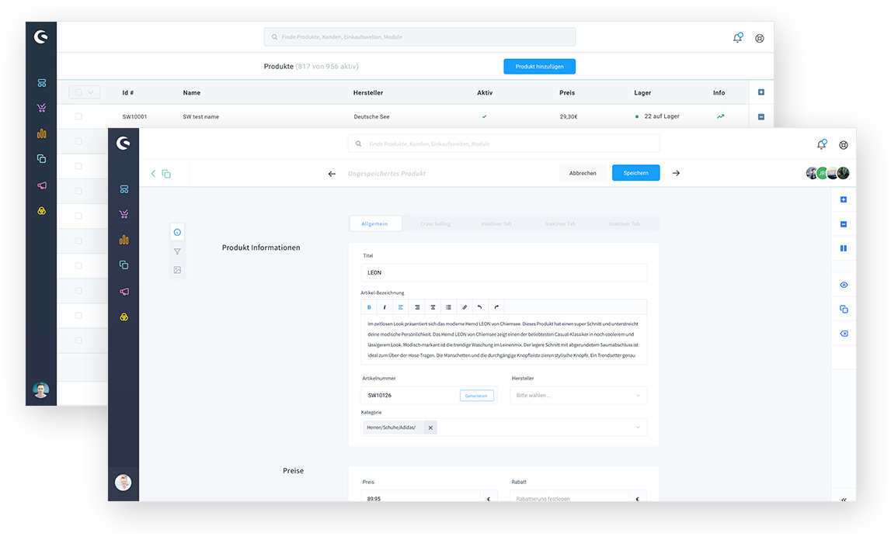
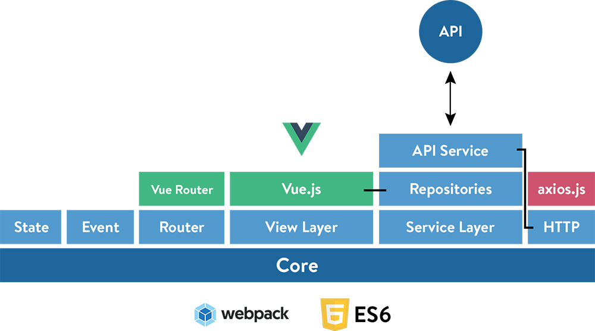
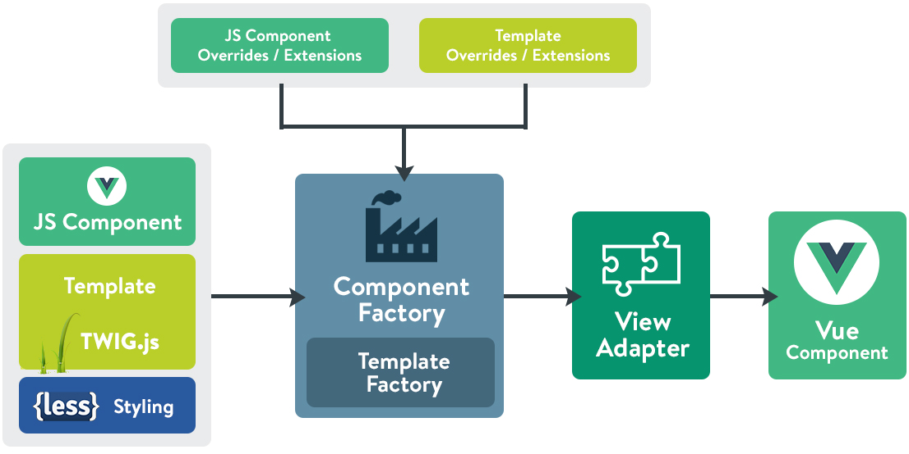
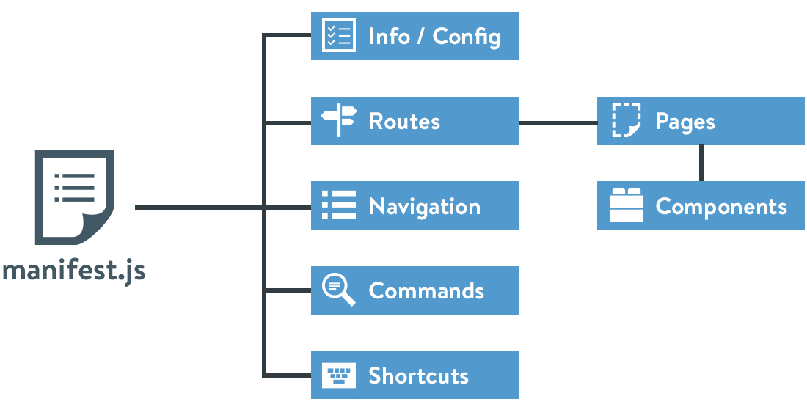
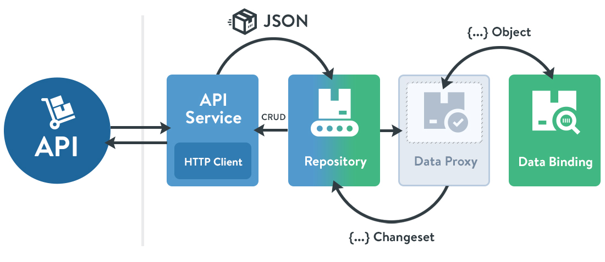
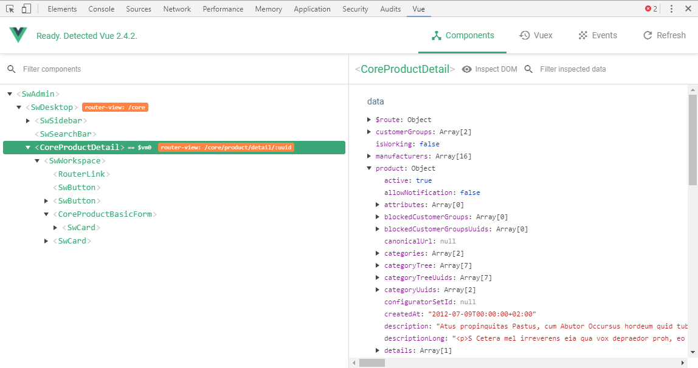

In the future we want to offer a complete new experience for the shop administration. Every user has to do very individual tasks to keep an online shop up and running. Therefore the administration panel must be very intuitive to fit every users needs. It should support your daily work so you can concentrate on the important things. Currently we are prototyping with new technologies to create a future-proof platform for a new shop administration.

## Changelog

#### Update from 2017-10-25
After we gathered your valuable feedback at the official **#MeetNext** event we used the chance to update this document with the latest information which were also introduced at the event. In the coming weeks we will process all your feedback and will update this document if necessary.

#### Update from 2017-09-27
Currently we are working on a concept for the data handling on the client side. We want the data logic to be completely separated from the view layer. On the other hand the data handling has also to fit the usability so that the user has a good understanding of when data is saved etc.

## Ideas
We want to give you a short overview of our technological goals we want to achieve with the new administration.

- Easy to learn technology stack
- Quick start possibilities for beginner and expert level developers
- Thin-layer architecture
- Component based view layer with client-side rendering
- Client-side routing and deep linking
- Easy extendable data flow
- Meaningful error messages and debugging tools
- Helpful tooling for developers

## Prototype architecture

To achieve the thin-layer architecture we decided to create a slim core in vanilla JavaScript using new **EcmaScript6** language features together with **Webpack** and **Babel.js** as build tools. On top of that core we added a small abstraction layer which is used to dock different tools to the core. 

For the client-side rendering and routing we decided to use the **Vue.js** framework. We think it combines the best of all worlds, for example the component based structure and the fast stateful rendering. It combines many good concepts of other popular frameworks. Check out the detailed guides and documentation on the [official website](https://vuejs.org/). 

For the business and data logic we created a service layer. The communication with the new api is done by different api services which can perform the typical CRUD operations. These services are used by the so called repositories which hold the business logic. The repositories can directly be used as mixins in Vue.js to get instant access to the data. All the data from a repository is automatically available in the data binding of your component so you can start using it in your template right away.

The api services are using the HTTP client to communicate with the api. Here we are using **axios.js** which is a lightweight tool to handle HTTP requests.

For the state and event management we are still in the concept phase. The solution will also depend on the usability concept. Possible solutions could be a flux model for the state handling and a global event bus.

## View layer

A big challenge in Shopware\Core still is the multi-level inheritance system where plugins can extend or override different parts of a template or the logic of a component in arbitrary manner. The possibility that more than one plugin can make changes in the same part of the application brings in a very high level of complexity. As we decided to dispense the server-side PHP process for the administration we had to find a capable solution for this on the client-side. The range of possible solutions is not very wide and we do not want to bend around the Vue.js framework either.

To avoid race conditions and keep the template inheritance logic away from the rendering we decided to create a bootstrapping process which collects all extensions and overrides before they get served to the rendering. Therefore we created the **ComponentFactory** which holds all registered components and their changes. After the initial bootstrapping process is completed the factory delivers the processed components to a view adapter which prepares the components for the rendering framework.

For changing templates we decided to use the JavaScript implementation of the template engine **Twig** and make use of its block system. As we're developing more and more towards a full-stack Symfony integration the Twig engine will be used for server-side rendered templates like the storefront. So we thought it could be a good solution to use the same technology for the administration. The template engine is well known by developers and the Shopware\Core inheritance system based on block placeholders could already prove its success in production for a long time now. To avoid the complexity of using two different frontend frameworks in the same place we configured Twig.js only for the usage of the block system. So we are using just the block placeholders for the template inheritance and leave all other tasks to the Vue.js framework. So in the template files of the components you will find normal Vue templates with some Twig blocks around it.

We use **LESS** as the CSS preprocessor because again it is the same technology we are already using in the storefront. But this is just our choice for the core. In your plugins you will serve the styling always as compiled CSS so it doesn't matter which technology you want to use to achieve this. As you have Webpack at hand you can use all common technologies for preprocessing.

Our product design team will develop a new design system for the administration. All components will be created from this new design system. For the logical structure we decided to orientate towards the **Atomic Design** principle by [Brad Frost](http://bradfrost.com/blog/post/atomic-web-design/). In our opinion the principle suits the concept of "composing with components" very well so the design system will go hand in hand with the technological solution of the Vue.js framework.

## Modules

It will be possible to easily create new modules for the administration by creating a `manifest.js` file which defines the important information of a module. Next to navigation entries, search commands and keyboard shortcuts you define new routes for the different views of a module. These routes are the entry points to the module and will render the corresponding page components, which define the largest type of component in the atomic design hierarchy. So the different views of a module are build by page components existing of other components from the core library or your own custom components.

## Data flow

We want the data handling to be as easy as possible so that you do not have to maintain any data models or extend those when you add new fields to an entity. The new api already serves well formed JSON structs including associated data of an entity. So the easiest way would be to work directly with these structs as plain objects because these are easy to handle in our JavaScript code. For example they could be used in the data binding of the Vue.js framework right away.

So the main entry point where the data and business logic takes place is a repository. The repository will use the corresponding api service to gather data for a specific entity type from the api. The repository will then wrap the data struct in a thin data proxy which will be used for all actions on that data. The proxy is just a small wrapper around the data providing some fancy background magic. To the outside the proxy exposes just a simple object containing the data which can be passed directly to the data binding. The reactive data binding then can change the data inside the proxy accordingly. The proxy itself can create simple changesets which can be directly used to send them back to the api to update entities with a patch request.

The nice thing about the repositories is, that you can use them as a mixin in your Vue.js components, which will already provide the complete data binding of the corresponding entity. So you can directly jump into your template an use the data. No extending of models or entity fields needed. When you want to implement your own business logic you can override single methods of the mixin directly in your component. For advanced control you can also use the api service directly to perform your own requests. All services are available via the dependency injection of the Vue.js framework.

## Tooling
The usage of Webpack and the Vue.js framework offers very helpful tooling for developers which can facilitate your daily work.

#### Hot reloading

For developing you can spawn a dev-server right from your CLI. This will also start a file watcher which will update the page directly when you make any changes. The nice thing about this is, that the application will keep its state also after refreshing. So you automatically stay at the same place where you're working at. The watcher also offers automatic linting using **ESLint** and will show a nice overlay with helpful error messages. 

#### Vue developer console

The Vue.js framework offers a nice extension for the chrome developer console. Here you have a reference to the original component structure and can inspect each component to get live information about its state, events and several other information. This can be a really helpful tool during development.

## The use of Webpack
Webpack's main purpose is to bundle JavaScript files for usage in a browser. It's also possible to transform, bundle and package all kind of resources for example stylesheets or images. To do so it builds a dependency graph that include every module of the application and then bundles all of those modules into one or more small bundles.

We're using Webpack to bundle all the parts of the administration interface into one handy bundled file for deployment but that's not all. We're using it to expose parts of the application into the global scope to provide an unified interface to interact with the application on the beginner user level. The style definition is written in [LESS](http://lesscss.org/) which will be transformed to plain CSS using Webpack too.

Please keep in mind that Webpack is only used as a tool for development. The application for the administration gets build and is delivered as one complete package. No compiling or build process is necessary in a normal installation of Shopware.

Webpack has 4 core concepts which enables you to customize it to your needs and process every tasks you want: **entry, output, loaders & plugins.** The core concepts of Webpack enable you as a third-party developer to use all the same tools we are using for developing. Webpack is able to identify the active plugins in the shop and processes the plugins JavaScript and LESS files and dumps out a compiled version into the plugin directory ready for deployment to the community store.
